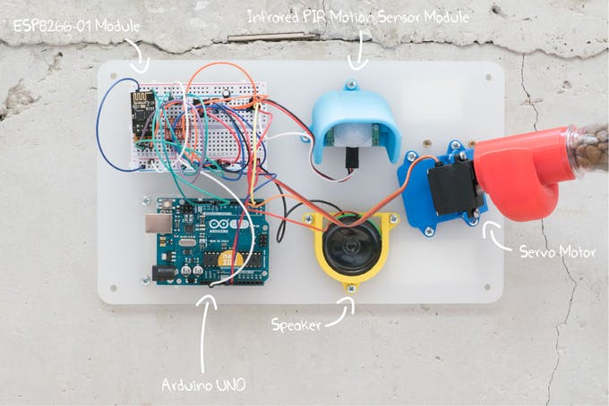

# project
จะเป็นโปรเจค เครื่องให้อาหารสัตว์อัตโนมัติ
ซึ่งในระบบจะมีอุปกรดั้งนี้
<a><b>Arduini uno</b>(จำเป็นต้องมี module wifi เพิ่ม) ,<b>ESP8266</b> หรือ <b>EPS32</b> </a>
<a><b>PIR Motion Sensor</b> เซ็นเซอร์จับตวามเคลื่อนไหว<a>
Servo Motor ขนาดเล็ก
speaker เป็นอ็อปชั้นเสริม

การทำงานของตัวระบบ
สามารถสั่งผ่าน ui เพื่อให้อาหารได้
สามารถ จับการเครื่อนไหว แล้วให้อาหารเมื่อจับได้ในระยะเวลานึง

ข้อดี
เป็นระบบง่ายๆไม่ค่อยซับซ่อน และสามารถทำได้ไม่ยาก
ตัวอุปการต่างๆราคาไม่สูง
 

 

