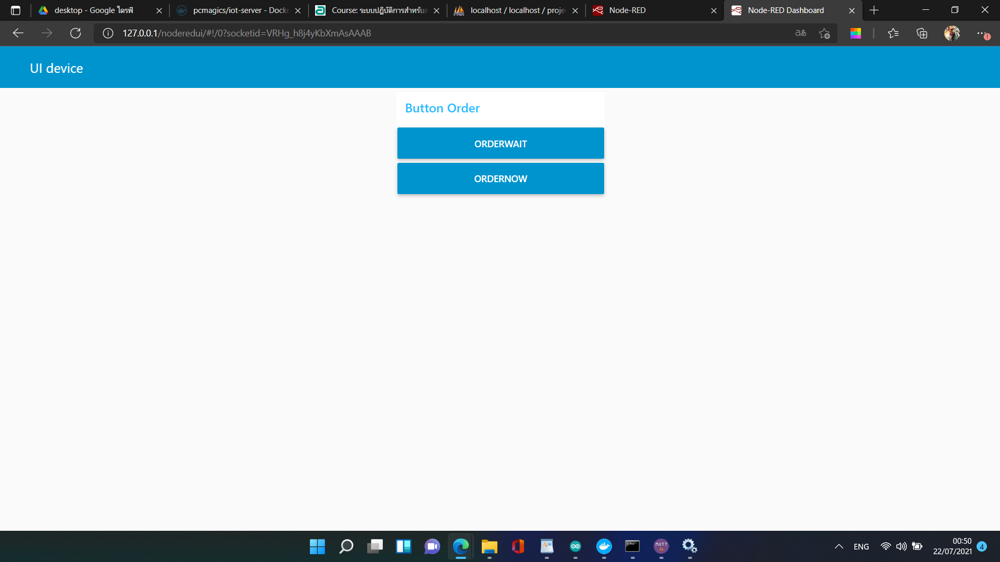

# project
จะเป็นโปรเจค เครื่องให้อาหารสัตว์อัตโนมัติ
ซึ่งในระบบจะมีอุปกรดั้งนี้
   
  <b><a href="https://store.arduino.cc/usa/arduino-uno-rev3">Arduini uno</b></a>
  (จำเป็นต้องมี module wifi เพิ่ม) ,<b><a href="https://store.arduino.cc/usa/arduino-uno-rev3">ESP8266</b></a> หรือ <b><a href="https://www.espressif.com/en/products/socs/esp8266">EPS32</b></a> 
<b><a href="https://learn.adafruit.com/pir-passive-infrared-proximity-motion-sensor">PIR Motion Sensor</b></a> เซ็นเซอร์จับตวามเคลื่อนไหว
<b><a href="https://www.myarduino.net/product/29/sg90-servo-motor-0-180-%E0%B8%AD%E0%B8%87%E0%B8%A8%E0%B8%B2">Servo Motor</a><b> ขนาดเล็ก
<b><a href="https://create.arduino.cc/projecthub/Rad_Silviu/speaker-with-arduino-be454c">speaker<a></b> เป็นอ็อปชั้นเสริม

การทำงานของตัวระบบ
สามารถสั่งผ่าน ui เพื่อให้อาหารได้
สามารถ จับการเครื่อนไหว แล้วให้อาหารเมื่อจับได้ในระยะเวลานึง

ข้อดี
เป็นระบบง่ายๆไม่ค่อยซับซ่อน และสามารถทำได้ไม่ยาก
ตัวอุปการต่างๆราคาไม่สูง
 

 
  ในตัวระบบ มีคำสั่งในการทำงานอยู่ 2 แบบที่สามารถทำผ่าน ui ได้
  คือ คำสั่ง
    Orderwait
    และ Ordernow 
   
  <b>Orderwait</b> เป็นคำสั่งในการหน่วงเวลาไว้ 30 วินาที ก่อนทำการเปิด servo เพื่อให้อาหาร
   
  <b>Ordernow</b> เป็นคำสั่งในการสั่งให้ servo ให้อาหารในทันที
   
  แล้วยังมี การให้อาหารเองหากเซ็นเซอร์ pir ตรวจจับการเคลื่อนไหวได้ในเวลานึง

